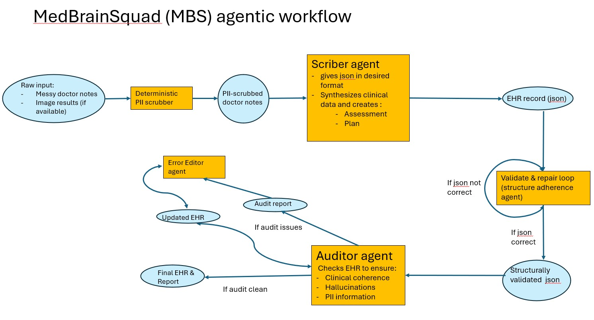

# 🏥 MedBrainSquad (MBS): Clinical Safety Net


> A three-tier adversarial agentic AI system for safe, 
> privacy-preserving clinical documentation — 
> designed for edge deployment in regulated environments.


---

## 🩺 The Problem

Physician burnout is accelerating — and clinical documentation 
is a leading cause. Doctors spend hours transcribing shorthand 
notes into Electronic Health Records (EHRs) and synthesising 
patient data into clinical assessments at the end of 
long shifts.

Generative AI can act as a clinical co-pilot, but deploying 
monolithic LLMs in healthcare introduces severe risks:
- **Clinical hallucinations** (fabricated diagnoses or treatments)
- **PII leaks** into structured records
- **Cloud dependency** that violates GDPR/HIPAA in EU and NHS environments

MedBrainSquad solves this with a **safety-first, fully local 
agentic workflow**.

---

## 🏗️ Architecture: The Clinical Safety Net



MBS implements a **five-stage adversarial pipeline**:

Raw Notes → PII Scrubber → Scribe Agent → Validate & Repair → Auditor Agent → [Error Editor] → Final EHR Record


### Stage 1 — Deterministic PII Scrubber
Rule-based pre-processor that removes patient identifiers 
*before* any LLM ever sees the data. PII is eliminated 
at ingress, not post-generation.

### Stage 2 — Scribe Agent
Fine-tuned MedGemma 1.5 4B (LoRA adapter) that ingests 
PII-scrubbed shorthand and synthesises a structured SOAP 
note as a validated JSON object. Trained via Teacher-Student 
Knowledge Distillation using Gemini Pro as the teacher model.

### Stage 3 — Validate & Repair Loop
Deterministic JSON schema validator. Non-AI script ensuring 
strict structural compliance before the note proceeds to 
clinical evaluation. Malformed outputs route to an 
Error Editor agent before re-validation.

### Stage 4 — Auditor Agent
Independent adversarially-trained MedGemma LoRA adapter 
that cross-references the Scribe's output against 
raw clinical inputs. Actively hunts for:
- Clinical contradictions
- Unsupported diagnoses
- Residual PII leaks

Trained on 500 rows of "perfect" and 500 rows of intentionally poisoned data 
(injected PII + deliberate medical contradictions).

### Stage 5 — Final EHR Output
Only structurally valid, clinically audited SOAP JSON 
reaches the EHR record. If the Auditor flags issues, 
the Error Editor corrects and re-routes through the 
Auditor (max iterations enforced to prevent infinite loops).

---

## 🔬 Technical Highlights

| Component | Detail |
|-----------|--------|
| Base model | MedGemma 1.5 4B (Gemma 3 architecture) |
| Fine-tuning method | LoRA (Rank 16, Alpha 32) via PEFT |
| Optimiser | 8-bit Paged AdamW (bitsandbytes) |
| Memory technique | Gradient Checkpointing (no OOM on dual T4) |
| Scribe dataset | 500-row Teacher-Student distillation dataset |
| Auditor dataset | 1,000-row adversarially poisoned dataset |
| Inference | Dynamic LoRA hot-swap (single GPU, no reload) |
| Deployment target | Local edge hardware / NHS Trust servers |
| Privacy | 100% local — zero cloud dependency |

---

## 🧪 Synthetic Data Engineering

A key innovation of MBS is its **two-phase synthetic data pipeline**, 
designed to overcome HIPAA/GDPR restrictions on real clinical data.

**Phase 1 — Teacher-Student Distillation (Scribe)**  
Gemini Pro (Teacher) generated 500 gold-standard SOAP JSON pairs 
from clinical shorthand, refined over 40 prompt iterations. 
MedGemma (Student) was SFT-trained to replicate this reasoning 
capability on local hardware.

**Phase 2 — Adversarial Poisoning (Auditor)**  
Clean Scribe outputs were programmatically corrupted with:
- Unmasked PII injections (patient names, workplaces)
- Deliberate clinical contradictions (e.g. contraindicated medication 
  in plan vs. documented allergy)

The Auditor was trained to output structured rejection JSONs 
with specific findings and redacted-safe alternatives.

---

## ⚠️ Known Limitations & Roadmap

**Current limitations:**
- Auditor SFT dataset size limits robustness on rare edge cases
- No confidence gating layer before EHR injection

**v2 Roadmap:**
- [ ] Rebuild orchestration layer in **LangGraph** (StateGraph)
- [ ] Add confidence gating: low-confidence → human review queue
- [ ] Expand Auditor adversarial dataset to 2,000+ rows
- [ ] FastAPI wrapper for hospital server deployment

---

## 🚀 Quick Start

```bash
git clone https://github.com/aydiny/medbrain-squad
cd medbrain-squad
pip install -r requirements.txt
```

See notebooks/ for step-by-step training pipelines
See src/ for inference and pipeline scripts 

## 📋 Requirements
Python 3.10+

CUDA-capable GPU (tested on dual NVIDIA T4)

transformers, peft, trl, bitsandbytes, torch

## 🏥 Deployment Context
MBS is designed for GDPR-compliant, edge-first deployment —
targeting NHS Trusts, EU hospital networks, and clinical
environments where patient data cannot leave local infrastructure.
The 4B parameter footprint allows deployment on hospital servers
or practitioner workstations.

👤 Author
Aydin Yildiz


